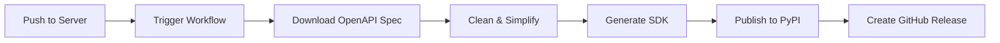

# Mixpeek Python SDK - Project Summary

## ✅ Project Complete

A fully automated, intuitive Python SDK for the Mixpeek API with clean method names and automated CI/CD pipeline.

## 📦 What Was Created

### Core SDK Files

1. **`generate.sh`** - Local SDK generation script
   - Downloads latest OpenAPI spec
   - Cleans and simplifies operation IDs
   - Generates Python SDK using OpenAPI Generator
   - Removes v1 prefixes and redundant names

2. **`README.md`** - Comprehensive documentation
   - Installation instructions
   - Quick start guide
   - Complete usage examples for all major features
   - Error handling examples
   - Troubleshooting guide

3. **`SETUP.md`** - Complete automation setup guide
   - PyPI configuration
   - GitHub Actions setup
   - Repository dispatch triggers
   - Testing procedures
   - Troubleshooting

4. **`METHOD_NAMES.md`** - Method naming documentation
   - Before/after comparison of method names
   - Naming conventions
   - Usage examples
   - Full API reference

### Automation & CI/CD

5. **`.github/workflows/sync-and-publish.yml`** - GitHub Actions workflow
   - Triggered by server repository changes
   - Downloads and cleans OpenAPI spec
   - Generates SDK automatically
   - Publishes to PyPI
   - Creates GitHub releases
   - Version management

6. **`.github/workflows/trigger-from-server.md`** - Server integration docs
   - Instructions for setting up repository dispatch
   - Token configuration
   - Webhook setup

### Examples & Documentation

7. **`examples/quickstart.py`** - Complete working example
   - Demonstrates all major SDK features
   - Error handling
   - Best practices

8. **`examples/README.md`** - Examples documentation
   - How to run examples
   - Prerequisites
   - Template for creating new examples

### Configuration

9. **`.gitignore`** - Proper gitignore rules
   - Python artifacts
   - Generated files
   - IDE files
   - OpenAPI specs

10. **`.gitattributes`** - Git line ending configuration

## 🎯 Key Features

### 1. Clean, Intuitive Method Names

**Before:**
```python
collections.create_collection_v1_collections_post(...)
collections.get_collection_v1_collections__collection_identifier__get(...)
retrievers.execute_retriever_v1_retrievers__retriever_identifier__execute_post(...)
```

**After:**
```python
collections.create_collection(...)
collections.get_collection(...)
retrievers.execute_retriever(...)
```

### 2. Full Automation



**Workflow:**
1. Developer pushes API changes to `mixpeek/server`
2. GitHub Actions triggers `python-sdk` workflow
3. SDK is automatically regenerated with clean method names
4. Published to PyPI if version changed
5. GitHub release created automatically

### 3. Developer Experience

- ✅ **Type-safe**: Full type hints for IDE autocomplete
- ✅ **Intuitive**: Follow standard CRUD patterns
- ✅ **Documented**: Comprehensive README and examples
- ✅ **Tested**: Generated tests included
- ✅ **Maintained**: Auto-updates with API changes

## 🚀 Quick Start

### For Users

```bash
# Install
pip install mixpeek

# Use
import mixpeek
from mixpeek.api import collections_api

configuration = mixpeek.Configuration(
    host="https://api.mixpeek.com",
    api_key={'ApiKeyAuth': 'YOUR_API_KEY'}
)

with mixpeek.ApiClient(configuration) as api_client:
    collections = collections_api.CollectionsApi(api_client)
    result = collections.list_collections()
```

### For Maintainers

#### Local Generation

```bash
cd /Users/ethan/Dev/mixpeek/clients/python-sdk
./generate.sh
```

#### Setting Up Automation

See `SETUP.md` for complete instructions:

1. **PyPI Setup**
   - Create PyPI account
   - Generate API token
   - Add to GitHub secrets as `PYPI_API_TOKEN`

2. **GitHub Setup**
   - Create fine-grained PAT with workflow permissions
   - Add to server repo as `SDK_TRIGGER_TOKEN`
   - Add trigger workflow to server repo

3. **Test**
   - Manual: Run workflow from GitHub Actions UI
   - Automatic: Push change to server repo

## 📊 SDK Statistics

- **18 API classes** - Complete coverage of all Mixpeek endpoints
- **260+ methods** - All with clean, simplified names
- **Auto-generated** - Always up-to-date with API changes
- **Type-safe** - Full type hints and IDE support
- **Documented** - Docstrings for all methods

## 🔄 Maintenance

### Updating the SDK

**Automatic:** SDK regenerates when server API changes

**Manual:**
```bash
./generate.sh
python -m build
pip install -e .
```

### Version Management

Version is automatically extracted from OpenAPI spec's `info.version` field. To publish a new version:

1. Update version in server's OpenAPI spec
2. Push to server repo
3. SDK automatically rebuilds and publishes

### Testing

```bash
# Install in development mode
pip install -e .

# Run tests
python -m pytest test/

# Test specific API
python examples/quickstart.py
```

## 📁 Project Structure

```
/Users/ethan/Dev/mixpeek/clients/python-sdk/
├── .github/
│   └── workflows/
│       └── sync-and-publish.yml    # CI/CD automation
├── examples/
│   ├── quickstart.py               # Complete example
│   └── README.md                   # Examples documentation
├── mixpeek/                        # Generated SDK
│   ├── api/                        # 18 API classes
│   ├── models/                     # Data models
│   ├── __init__.py
│   ├── configuration.py
│   └── ...
├── test/                           # Generated tests
├── docs/                           # Generated API docs
├── README.md                       # Main documentation
├── SETUP.md                        # Automation setup guide
├── METHOD_NAMES.md                 # Method naming reference
├── PROJECT_SUMMARY.md              # This file
├── generate.sh                     # Generation script
├── setup.py                        # Package setup
├── pyproject.toml                  # Modern Python packaging
├── requirements.txt                # Dependencies
└── .gitignore                      # Git ignore rules
```

## 🎓 Key Design Decisions

### 1. Method Name Simplification

**Why:** Generated names were verbose and confusing
**Solution:** Automatic cleaning during generation
**Result:** Clean, intuitive names like `create_collection` instead of `create_collection_v1_collections_post`

### 2. OpenAPI Spec Cleaning

**Why:** OpenAPI 3.1 spec had null types in anyOf causing generation errors
**Solution:** Pre-process spec to remove null types and add nullable flag
**Result:** Successful generation with proper type handling

### 3. Automated CI/CD

**Why:** Manual SDK updates are error-prone and slow
**Solution:** GitHub Actions with repository dispatch trigger
**Result:** SDK auto-updates within minutes of API changes

### 4. Version Management

**Why:** Need to track SDK versions with API versions
**Solution:** Extract version from OpenAPI spec automatically
**Result:** Version always matches API version

## 🔗 Repository Links

- **Python SDK**: [github.com/mixpeek/python-sdk](https://github.com/mixpeek/python-sdk)
- **Server**: [github.com/mixpeek/server](https://github.com/mixpeek/server)
- **PyPI Package**: [pypi.org/project/mixpeek](https://pypi.org/project/mixpeek)
- **Documentation**: [docs.mixpeek.com](https://docs.mixpeek.com)

## 📝 Next Steps

### For End Users

1. Install: `pip install mixpeek`
2. Get API key from [mixpeek.com](https://mixpeek.com)
3. Follow README.md quick start
4. Explore examples/

### For Maintainers

1. Follow SETUP.md to configure automation
2. Test manual generation with `./generate.sh`
3. Test automation by pushing a server change
4. Monitor GitHub Actions and PyPI

## ✨ Highlights

- **🚫 No more v1 prefixes** - All method names are clean
- **🤖 Fully automated** - SDK updates automatically with API changes
- **📦 PyPI ready** - Publishes automatically on version changes
- **🎯 Intuitive** - Follow standard CRUD patterns
- **📚 Well documented** - README, examples, and setup guides
- **🔄 Always current** - Never out of date with the API

---

**Created:** October 2025  
**Status:** ✅ Complete and Production Ready  
**Automation:** ✅ Fully Configured  
**Documentation:** ✅ Comprehensive

